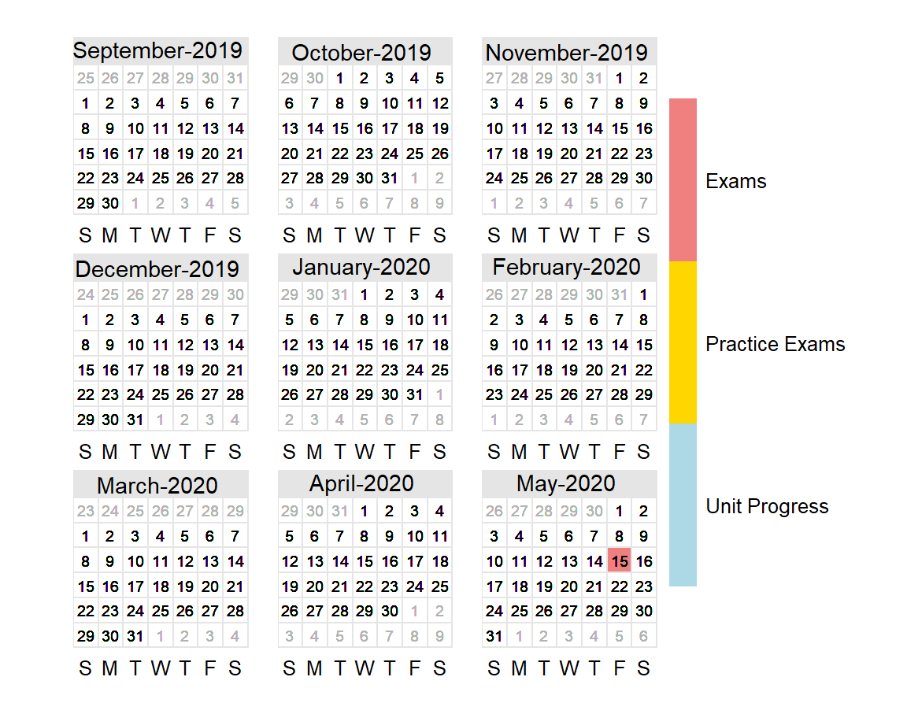
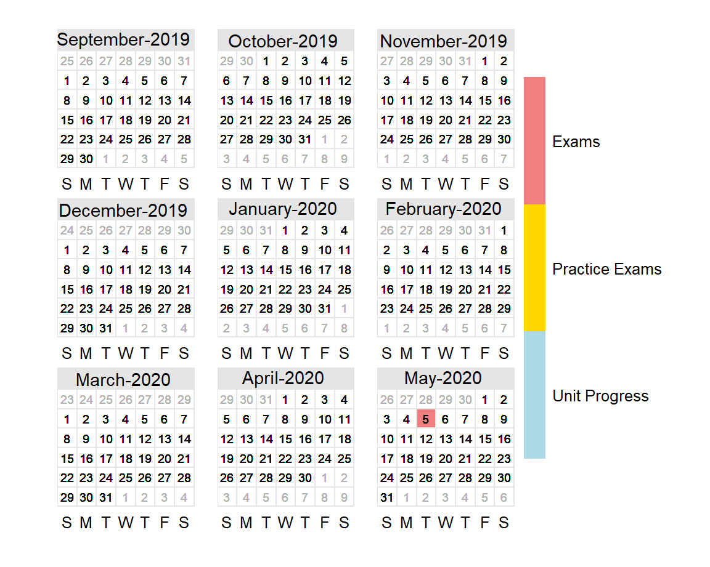

Calculus AB
===================================== 

Column {data-width=550}
-----------------------------------------------------------------------

### <b>2019--2020 Calculus AB Calendar</b>

> \*AP is a registered trademark of the College Board, which was not involved in the production of this webpage. The dates in this calendar apply only to Mr. Li's calculus classes.

Column {data-width=450, .tabset}
-----------------------------------------------------------------------
### <b>Calculus AB Dates</b>

preserve0ba85257ed89667b

> Filter by Type (1 = Unit Progress, 2 = Practice Exams, 3 = Exams)

Calculus BC
===================================== 

Column {data-width=550}
-----------------------------------------------------------------------

### <b>2019--2020 Calculus BC Calendar</b>

> \*AP is a registered trademark of the College Board, which was not involved in the production of this webpage. The dates in this calendar apply only to Mr. Li's calculus classes.

Column {data-width=450, .tabset}
-----------------------------------------------------------------------
### <b>Calculus BC Dates</b>

preserve9f0b47a1587f4d99

> Filter by Type (1 = Unit Progress, 2 = Practice Exams, 3 = Exams)
